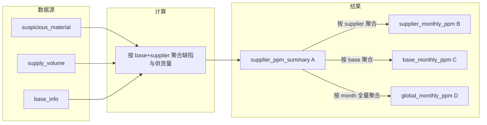

# PPM 多维度计算逻辑设计

本文档明确四类 PPM 的计算逻辑、数据来源、聚合维度及与现有实现的关系。实现时优先「先算 A，再由 A 聚合得到 B、C、D」，保证口径一致。

---

## 一、概述与公式

### 1.1 统一公式

```
PPM = (不合格数 / 供货量) × 1,000,000
```

- 供货量为 0 时不计算 PPM，该维度不写入结果。
- PPM 值存储为 `DECIMAL(12,2)`，保留两位小数，四舍五入。

### 1.2 口径规则（与飞书河西基地一致）

以下规则已应用于**类型 A** 的计算（见 `PpmCalculateService`）：

| 规则 | 说明 |
|------|------|
| 不合格数 | 仅统计**是否供应商责任 = "Y"**的可疑物料（`supplier_resp = 'Y'`）；其余不参与汇总。 |
| 供货量 | **排除**零件名称（`part_name`）包含「螺栓」「螺母」「卡扣」的供货量行；其余参与汇总。 |

B、C、D 由 A 聚合得出时，自然继承上述口径。

### 1.3 四类 PPM 总览

| 类型 | 维度 | 聚合键 | 说明 |
|------|------|--------|------|
| **A. 基地×供应商×月份** | 每月、每基地、每供应商一条 | (ppm_month, base_code, supplier_code) | 已实现；该基地该供应商当月不合格数/供货量 → PPM |
| **B. 供应商×月份** | 每月、每供应商一条 | (ppm_month, supplier_code) | 该供应商在所有基地的不合格数合计/供货量合计 → PPM |
| **C. 基地×月份** | 每月、每基地一条 | (ppm_month, base_code) | 该基地所有供应商的不合格数合计/供货量合计 → PPM |
| **D. 全系统×月份** | 每月一条 | (ppm_month) | 所有基地、所有供应商的不合格数合计/供货量合计 → PPM |

---

## 二、数据源与映射规则

### 2.1 不合格数（缺陷）

- **表**：`suspicious_material`（可疑物料统计）。
- **时间**：`record_date` 落在当月（当月 1 日～当月最后一日）。
- **基地映射**：`plant`（区域工厂）→ base_code，规则：字符串包含「河西」→ 河西、「宝骏」→ 宝骏、「青岛」→ 青岛、「重庆」→ 重庆。
- **取值**：`defect_count` 优先；为空时用 `quantity`。
- **过滤**：仅 `supplier_resp = 'Y'` 参与汇总（类型 A 已实现）。

### 2.2 供货量

- **表**：`supply_volume`（基地供货量）。
- **时间**：`fiscal_year` 等于计算月份所在年。
- **基地映射**：`plant_id` → base_code，通过固定映射表（如 8200→重庆、8000→宝骏、1000/6430→河西、3000/6400→青岛）及 `base_info` 校验。
- **取值**：`month_x_no` 求和。
- **过滤**：排除 `part_name` 包含「螺栓」「螺母」「卡扣」的行（类型 A 已实现）。

### 2.3 基地主数据

- **表**：`base_info`。仅 `base_code` 在 `base_info` 中的基地参与计算，否则该条可疑物料/供货量不参与聚合。

---

## 三、四类 PPM 计算逻辑

### 3.1 A. 基地×供应商×月份（已实现）

- **聚合键**：(ppm_month, base_code, supplier_code)。
- **缺陷**：可疑物料中 record_date 在当月、plant→base 有效、supplier_resp='Y'，按 (base_code, supplier_code) 汇总不合格数。
- **供货量**：供货量中 fiscal_year 为年、plant_id→base 有效、part_name 非螺栓/螺母/卡扣，按 (base_code, supplier_code) 汇总 month_x_no。
- **PPM**：对每个 (base_code, supplier_code)，若 supply_qty > 0，则 PPM = (defect_count / supply_qty) × 10^6。
- **输出**：表 `supplier_ppm_summary`（已存在）。

### 3.2 B. 供应商×月份（设计）

- **聚合键**：(ppm_month, supplier_code)。
- **缺陷**：同一供应商在所有基地的不合格数之和（可由 A 表按 supplier_code 汇总 defect_count）。
- **供货量**：同一供应商在所有基地的供货量之和（可由 A 表按 supplier_code 汇总 supply_qty）。
- **PPM**：Σ不合格数 / Σ供货量 × 10^6。
- **输出**：建议表 `supplier_monthly_ppm_summary` 或查询层由 A 表聚合。

### 3.3 C. 基地×月份（设计）

- **聚合键**：(ppm_month, base_code)。
- **缺陷**：同一基地所有供应商的不合格数之和（可由 A 表按 base_code 汇总 defect_count）。
- **供货量**：同一基地所有供应商的供货量之和（可由 A 表按 base_code 汇总 supply_qty）。
- **PPM**：Σ不合格数 / Σ供货量 × 10^6。
- **输出**：建议表 `base_monthly_ppm_summary` 或查询层由 A 表聚合。

### 3.4 D. 全系统×月份（设计）

- **聚合键**：(ppm_month)，每月一条。
- **缺陷**：所有基地、所有供应商当月不合格数之和（可由 A 表按 ppm_month 全量汇总 defect_count）。
- **供货量**：所有基地、所有供应商供货量之和（可由 A 表按 ppm_month 全量汇总 supply_qty）。
- **PPM**：Σ不合格数 / Σ供货量 × 10^6，体现全公司该月整体 PPM。
- **输出**：建议表 `global_monthly_ppm_summary` 或查询层由 A 表聚合。

---

## 四、数据流与依赖关系



- 原始数据来自 `suspicious_material`、`supply_volume`、`base_info`。
- 先按 (base, supplier) 聚合缺陷与供货量，得到 A 并写入 `supplier_ppm_summary`。
- B、C、D 由 A 表按 supplier、base 或 ppm_month 聚合得到，保证与 A 口径一致。

---

## 五、表结构建议与实现顺序

### 5.1 B. 供应商×月份

建议表名：`supplier_monthly_ppm_summary`。

| 列名 | 类型 | 说明 |
|------|------|------|
| id | BIGINT PK AUTO_INCREMENT | 主键 |
| ppm_month | VARCHAR(8) NOT NULL | yyyyMM |
| supplier_code | VARCHAR(32) NOT NULL | 供应商编码 |
| supplier_name | VARCHAR(128) | 供应商名称 |
| defect_count | INT NOT NULL | 不合格数合计 |
| supply_qty | INT NOT NULL | 供货量合计 |
| ppm | DECIMAL(12,2) NOT NULL | PPM |
| created_at / updated_at | DATETIME | 审计 |

唯一约束：(ppm_month, supplier_code)。索引：ppm_month, supplier_code。

### 5.2 C. 基地×月份

建议表名：`base_monthly_ppm_summary`。

| 列名 | 类型 | 说明 |
|------|------|------|
| id | BIGINT PK AUTO_INCREMENT | 主键 |
| ppm_month | VARCHAR(8) NOT NULL | yyyyMM |
| base_id | BIGINT | 关联 base_info.id |
| base_code | VARCHAR(32) NOT NULL | 基地编码 |
| base_name | VARCHAR(64) | 基地名称 |
| defect_count | INT NOT NULL | 不合格数合计 |
| supply_qty | INT NOT NULL | 供货量合计 |
| ppm | DECIMAL(12,2) NOT NULL | PPM |
| created_at / updated_at | DATETIME | 审计 |

唯一约束：(ppm_month, base_code)。索引：ppm_month, base_code。

### 5.3 D. 全系统×月份

建议表名：`global_monthly_ppm_summary`。

| 列名 | 类型 | 说明 |
|------|------|------|
| id | BIGINT PK AUTO_INCREMENT | 主键 |
| ppm_month | VARCHAR(8) NOT NULL UNIQUE | yyyyMM，每月一条 |
| defect_count | INT NOT NULL | 不合格数合计 |
| supply_qty | INT NOT NULL | 供货量合计 |
| ppm | DECIMAL(12,2) NOT NULL | PPM |
| created_at / updated_at | DATETIME | 审计 |

索引：ppm_month（唯一）。

### 5.4 实现顺序

1. 保持 A 不变（已实现，含供应商责任与零件排除规则）。
2. 实现 B：在 A 计算完成后，按 (ppm_month, supplier_code) 聚合 A 表写入 `supplier_monthly_ppm_summary`。
3. 实现 C：按 (ppm_month, base_code) 聚合 A 表写入 `base_monthly_ppm_summary`。
4. 实现 D：按 ppm_month 全量聚合 A 表写入 `global_monthly_ppm_summary`。
5. 触发时机：与现有一致（导入可疑物料/供货量后触发当月计算）；同一流程内先算 A，再写 B、C、D。

---

## 六、与现有 PpmCalculateService 的对应关系

- **类型 A**：由 [PpmCalculateService.calculate(String ppmMonth)](ppm-system/ppm-backend/src/main/java/com/ppm/service/PpmCalculateService.java) 实现。流程：校验 ppm_month → 取 base_info → 按当月查 suspicious_material、按年查 supply_volume → 按 (base, supplier) 聚合（不合格数仅 supplier_resp='Y'，供货量排除螺栓/螺母/卡扣）→ 写 supplier_ppm_summary。
- **类型 B、C、D**：当前未实现。建议在 A 写入后，在同一事务或同一调度任务中，对 `supplier_ppm_summary` 做 SQL 或内存聚合，写入上述三张表或通过视图/查询接口提供；不修改 A 的聚合逻辑，仅在其结果上做二次聚合。

本文档仅描述设计与表结构，具体建表与代码实现见后续开发任务。
