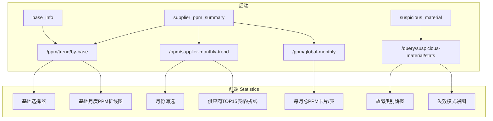

# 前端多维度 PPM 展示设计文档

## 一、需求与对应方案总览

| 需求                           | 方案概要                         | 后端                                   | 前端               |
| ---------------------------- | ---------------------------- | ------------------------------------ | ---------------- |
| 1. 不同基地在每月的 PPM，按钮选基地展示      | 基地选择器 + 该基地各月 PPM 折线/表       | 新增「基地月度 PPM」接口（按 base 聚合）            | 统计页：基地按钮组 + 图表   |
| 2. 不同供应商在每月的 PPM，TOP15，可筛选月份 | 月份筛选 + TOP15 供应商多月的 PPM 折线或表 | 新增「供应商月度趋势 TOP15」或复用 list 按月份取 TOP15 | 统计页：月份选择 + 表格/折线 |
| 3. 每月总 PPM（全公司）              | 展示每月一条：总不合格数/总供货量×10^6       | 新增「全局月度 PPM」接口                       | 统计页：卡片或表格        |
| 4. 饼图：失效模式分析、故障类别分析          | 两张饼图，数据来自可疑物料统计              | 故障类别已有；失效模式需按 failure_desc 聚合        | 统计页或工作台：双饼图      |

---

## 二、数据与口径说明

- **基地月度 PPM**（需求 1）：按 (ppm_month, base_code) 汇总 `supplier_ppm_summary` 的 defect_count、supply_qty，再 PPM = Σ缺陷/Σ供货量×10^6。与 [PPM多维度计算设计](PPM多维度计算设计.md) 中类型 C 一致。
- **供应商月度 PPM TOP15**（需求 2）：按 (ppm_month, supplier_code) 汇总 A 表，得到各月各供应商 PPM；按「选定月份或最近 N 月」取 TOP15（可按 PPM 或缺陷量排序），再展示这些供应商在各月的 PPM。
- **每月总 PPM**（需求 3）：按 ppm_month 汇总 A 表，Σ defect_count、Σ supply_qty，PPM = Σ缺陷/Σ供货量×10^6。与设计文档中类型 D 一致。
- **故障类别**（需求 4）：已有 [SuspiciousStatsService](ppm-backend/src/main/java/com/ppm/service/SuspiciousStatsService.java) 按 `fault_type` 聚合，返回 [SuspiciousMaterialStatsVo.byFaultType](ppm-backend/src/main/java/com/ppm/dto/SuspiciousMaterialStatsVo.java)。
- **失效模式**（需求 4）：可疑物料表有 `failure_desc`（失效描述），需按该字段聚合统计，用于「失效模式分析」饼图。

---

## 三、后端接口设计

### 3.1 基地月度 PPM（需求 1）

- **接口**：`GET /api/ppm/trend/by-base`
- **参数**：`baseCode`（必填，基地编码）、`limitMonths`（可选，默认 12）
- **响应**：`{ months: string[], defectCounts: number[], supplyQtys: number[], ppmValues: number[] }`，按月份顺序，与 months 一一对应。
- **实现**：从 `supplier_ppm_summary` 中 WHERE base_code = ?，按 ppm_month 排序，GROUP BY ppm_month 汇总 defect_count、supply_qty，再计算 PPM。可在 [PpmSummaryService](ppm-backend/src/main/java/com/ppm/service/PpmSummaryService.java) 新增方法，[PpmController](ppm-backend/src/main/java/com/ppm/controller/PpmController.java) 新增端点。

### 3.2 供应商月度 PPM TOP15（需求 2）

- **方案 A（推荐）**：`GET /api/ppm/supplier-monthly-trend?limitMonths=12`
  - 响应：`{ months: string[], series: [{ supplierCode, supplierName, ppmValues: number[] }] }`，series 长度为 15，为最近一个月（或 limitMonths 内）按 PPM 或缺陷量取 TOP15 的供应商，再回填这些供应商在各月的 PPM。
- **方案 B**：仅筛选单月时，复用现有 `GET /api/ppm/list?ppmMonth=yyyyMM`，前端取前 15 条；多月展示时再增加上述 supplier-monthly-trend。
- **数据**：由 `supplier_ppm_summary` 按 (ppm_month, supplier_code) 聚合得到供应商×月份 PPM，再按规则取 TOP15。

### 3.3 每月总 PPM（需求 3）

- **接口**：`GET /api/ppm/global-monthly`
- **参数**：`limitMonths`（可选，默认 12）
- **响应**：`{ items: [{ ppmMonth, defectCount, supplyQty, ppm }] }`，按月份排序。
- **实现**：`supplier_ppm_summary` 按 ppm_month GROUP BY，SUM(defect_count)、SUM(supply_qty)，再 PPM = sum_defect/sum_supply×10^6。可在 PpmSummaryService 新增方法，PpmController 新增端点。

### 3.4 失效模式分析（需求 4）

- **接口**：复用 `GET /api/query/suspicious-material/stats`，扩展响应体。
- **扩展**：在 [SuspiciousMaterialStatsVo](ppm-backend/src/main/java/com/ppm/dto/SuspiciousMaterialStatsVo.java) 中新增 `List<NameCount> byFailureDesc`（或 byFailureMode）；在 [SuspiciousStatsService.getStats](ppm-backend/src/main/java/com/ppm/service/SuspiciousStatsService.java) 中遍历可疑物料按 `failure_desc`（空则归为「未分类」）聚合计数，填入 byFailureDesc。
- **故障类别**：已有 byFaultType，前端直接用于「故障类别分析」饼图。

---

## 四、前端页面与组件设计

### 4.1 页面归属

- **统计分析页 Statistics.vue**：集中承载需求 1、2、3、4（基地选择、供应商 TOP15、每月总 PPM、双饼图）。工作台 Dashboard.vue 可保留现有「可疑物料统计」概览，或改为跳转统计页；若需在工作台保留部分图表，可仅保留简化版并与统计页联动。

### 4.2 需求 1：不同基地在每月的 PPM

- **交互**：基地选择器（按钮组或下拉），选项来自 `GET /api/base/list`（已有）。选择后请求 `GET /api/ppm/trend/by-base?baseCode=xxx&limitMonths=12`。
- **展示**：折线图，X 轴为月份（如 2025-01），Y 轴为 PPM；一条线表示当前选中基地在各月的 PPM。可选：表格展示月份、不合格数、供货量、PPM。

### 4.3 需求 2：不同供应商在每月的 PPM（TOP15，可筛选月份）

- **交互**：月份筛选（单月或最近 N 月）。若为单月，可用现有 `getPpmListByMonth(ppmMonth)`，前端按 PPM 排序取 TOP15 展示表格或柱状图；若为多月，调用新接口 `supplier-monthly-trend`，展示 TOP15 供应商在多月的 PPM 折线图（每条线一个供应商）。
- **展示**：表格列可为「供应商、各月 PPM、平均/合计」；或折线图 X=月份、Y=PPM、系列=TOP15 供应商。

### 4.4 需求 3：每月总 PPM

- **交互**：可选 limitMonths（如 6/12/24）。
- **展示**：卡片或表格：月份、总不合格数、总供货量、总 PPM。可配简单折线图（X=月份，Y=总 PPM）。

### 4.5 需求 4：饼图——失效模式分析、故障类别分析

- **数据**：故障类别用现有 `getSuspiciousMaterialStats` 的 `byFaultType`；失效模式用扩展后的 `byFailureDesc`（或 byFailureMode）。
- **展示**：同一区域两块饼图：「故障类别分析」（fault_type）、「失效模式分析」（failure_desc）。图例与数据标签策略可与现有 Dashboard 故障类别饼图一致（如仅展示数量前 N 的标签，其余悬停显示）。
- **筛选**：日期范围与现有 stats 一致（全部/指定月份），与可疑物料统计接口的 recordDateFrom、recordDateTo 保持一致。

---

## 五、数据流示意

---

## 六、实现顺序建议

1. **后端**：实现 global-monthly、trend/by-base、SuspiciousMaterialStatsVo + SuspiciousStatsService 的 byFailureDesc；再实现 supplier-monthly-trend（或先仅支持单月 TOP15 用现有 list）。
2. **前端**：在 Statistics.vue 增加「每月总 PPM」区块与「基地选择 + 基地月度 PPM 图」；接入新接口；增加失效模式饼图并与故障类别饼图并列；最后增加供应商 TOP15 多月份展示（表格或折线）。
3. **联调**：确认口径与 [PPM多维度计算设计](PPM多维度计算设计.md) 中 C、D 一致（若后端 B、C、D 表未建，仍可由 supplier_ppm_summary 聚合得出）。

---

## 七、产出物

- **设计文档**：本文档（ppm-system/docs/前端多维度PPM展示设计.md）。
- 不修改计划文件；具体开发按本设计在后续任务中实现接口与页面。
